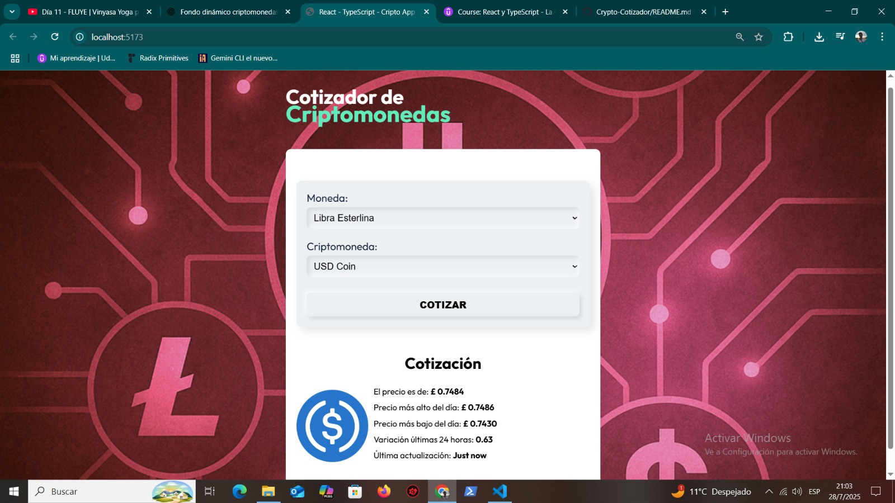

# 🚀 Cripto Cotizador




---

## ✨ Descripción

**Cripto Cotizador** es una aplicación **frontend** moderna que te permite consultar el precio de las principales criptomonedas en distintas monedas fiduciarias.  
Este proyecto se realizó como **muestra para mi portafolio**, demostrando mis habilidades en diseño neumórfico y desarrollo con React/TypeScript.

- 🎨 **Diseño Modern Neumorphic**: formulario “hundido” e inputs “elevados”.  
- 🌈 **Fondo dinámico** con ligero filtro hue-rotate que da vida al background.  
- ⚡ **Fetch en tiempo real** desde la [API de CoinGecko](https://www.coingecko.com/).  
- 🧑🏻‍💻 Construida con **Vite + React + TypeScript** y gestión de estado con **Zustand**.

---

## 🛠 Tecnologías

| 🌐 Frontend  | 📦 Bundler    | 🚀 Estado    | 🎨 Estilos          |
| ------------ | ------------ | ------------ | ------------------- |
| React        | Vite         | Zustand      | CSS3 (Neumorphic)   |
| TypeScript   | –            | –            | Google Fonts: Outfit |

---

## 🚀 Instalación y ejecución

1. **Clona el repositorio**  
   ```bash
   git clone https://github.com/christofa2000/Crypto-Cotizador.git
   cd cripto-cotizador
